# PolymorPIC: Embedding Polymorphic Processing-in-Cache in RISC-V based Processor for Full-stack Efficient AI Inference

[](https://dl.acm.org/doi/full/10.1145/3725843.3756066)
[](https://github.com/ucb-bar/chipyard)
[](https://riscv.org/)
[](https://opensource.org/license/mulanpsl-2-0)

Official Manual of PolymorPIC deployment on FPGA, inclduing module test on both simulator and Linux running on FPGA.

>**[PolymorPIC: Embedding Polymorphic Processing-in-Cache in RISC-V based Processor for Full-stack Efficient AI Inference](https://dl.acm.org/doi/full/10.1145/3725843.3756066)**  
> Cheng Zou, Ziling Wei, Jun Yan Lee, Chen Nie, Kang You, Zhezhi He  
> *Proceedings of Proceedings of the 58th IEEE/ACM International Symposium on Microarchitecture (MICRO), 2025*

Please cite this work if this manual or work help your research or project:
```
@inproceedings{zou2025polymorpic,
author = {Zou, Cheng and Wei, Ziling and Lee, Jun Yan and Nie, Chen and You, Kang and He, Zhezhi},
title = {PolymorPIC: Embedding Polymorphic Processing-in-Cache in RISC-V based Processor for Full-stack Efficient AI Inference},
year = {2025},
isbn = {9798400715730},
publisher = {Association for Computing Machinery},
address = {New York, NY, USA},
url = {https://doi.org/10.1145/3725843.3756066},
doi = {10.1145/3725843.3756066},
pages = {1609–1624},
numpages = {16},
keywords = {Processing-in-Cache, Neural Network Acceleration, AIoT, Area-Efficient SoC, RISC-V, Full-stack},
location = {},
series = {MICRO '25}
}
```


We introduce it with the following order:
1) Brief introduction of the RTL structure.
2) Add modified/customized codes to Chipyard, including controller/scheduler modules and modified inclusive cache modules (rocket-chip-inclusive-cache). We pack all the design code within rocket-chip-inclusive-cache and make it a new folder as rocket-chip-inclusive-cache-pic-virtual.
3) Module test in Chipyard via verilator or vcs under baremetal mode.
4) Deployment on FPGA with Linux running.


### Software Prerequisites
1. Chipyard12
2. Vivado2022.2 (32GB RAM host, 16GB RAM is not enough)

## 1. RTL Structure

The follwoing figure shows the RTL modules overall view from `DigitalTop` Module.
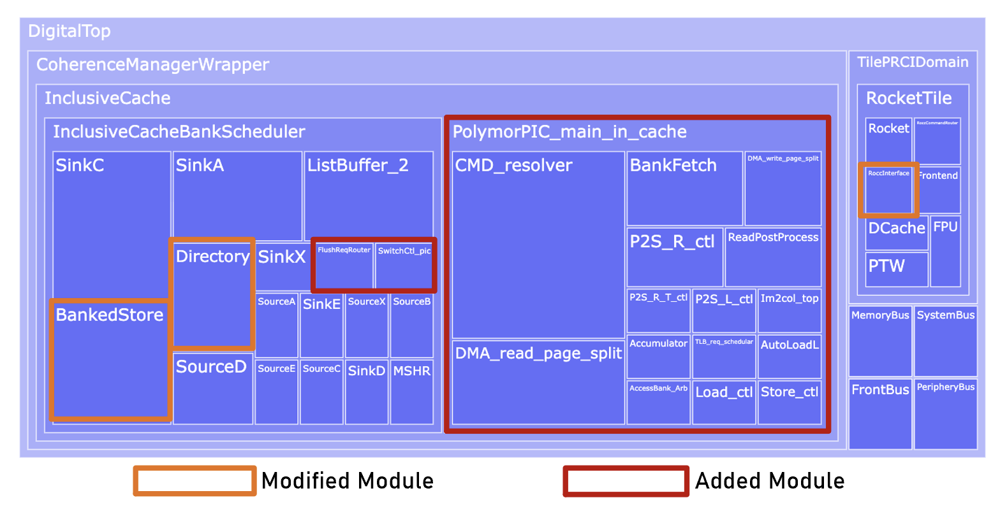
The `DigitalTop` module is an SoC module with certain peripherals excluded, mainly comprising various buses, the Rocket core, and the LLC module.
The origine line is the module modified in PolymorPIC, and the red box is the added modules.


<ol>
<li>RoCC interface in <code>RockerTile</code> module</li>
Based on the RoCC interface specification, functionality to receive instructions from the CPU and forward them to the PolymorPIC main (<code>PolymorPIC_main_in_cache</code>) module.

<li>Added Modules in PolymorPIC main module</li>
<code>PolymorPIC_main_in_cache</code> is PolymorPIC main module, including <code>CMD_resolver</code> and other Data Process Modules.
<code>CMD_resolver</code> receives command from bus (sent from RoCC interface in Core). Then it conducts instruction decoding and send execution requests to respective processing units. It also returns operational status data through the bus back to the RoCC, which will further return it to user program.

Other modules like DMA, P2S and im2col work to read/write and process data from/to PIC part LLC (<code>InclusiveCache</code>).
For easy communication with LLC, <code>PolymorPIC_main_in_cache</code> module is put inside LLC module.

<li>Modified LLC</li>
<code>SwitchCtl_pic</code> module is added to handle PIC allocation/release request. 

<code>FlushReqRouter</code> module is added to handle direct cache flush for PIC allocaion.

<code>Directory</code> module is modified to 1) handle direct queries from <code>FlushReqRouter</code>. 2) Keep PIC mode cache ways isolated from normal CPU programs.

<code>BankStore</code> module is modifed to add Bit-serial Process Engine under arrays to support near memory computing.

</ol>

### BankStore

In this demo, LLC is configured as a 1 MB, 16-way set-associative cache. Each sub-array is sized 512$\times$64, and each Mat contains four sub-arrays. The i-th Mat of each Bank together forms a *Level*. Level 0 is reserved exclusively for use as the CPU cache, while the other levels can be switched to PIC mode.

The following figure shows the structure.

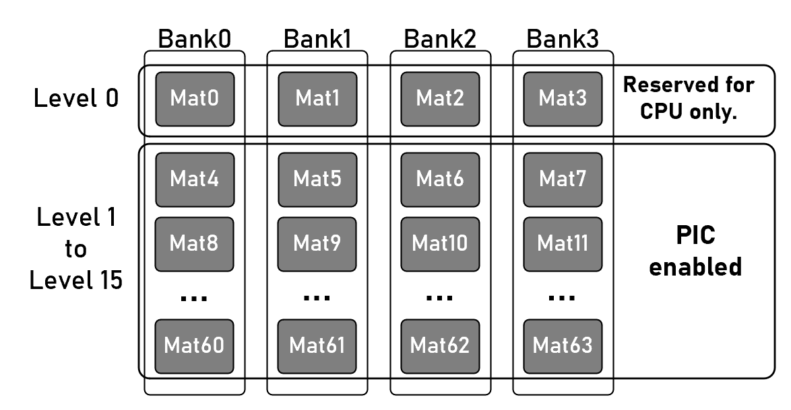

## 2. Embed PolymorPIC code into Chipyard.

**Only chipyard12 is verified and supported for this demo.**

Follow the following steps to put PolymorPIC code to chipyard and modify some configuration files. Each step title indicates the **direct operation** to be performed, and the content beneath the title explains the **reasons and details of that step**.

<ol>
<li>Copy the folder <code>rocket-chip-inclusive-cache-pic-virtual</code> in this repo to the folder <code>generators</code> in chipyard.</li>
<br>

The PolymorPIC code is located along side inclusive cache for easy getting LLC parameters. 

The folder <code>rocket-chip-inclusive-cache-pic-virtual</code> contains the code of modified `InclusiveCache` and our <code>PolymorPIC_main_in_cache</code> module.

The <strong>virtual</strong> in the name means it <strong>supports operation system</strong>.

<li>For rocket, replace <samp>generators/rocket-chip/src/main/scala/tile/LazyRoCC.scala</samp> with <code>LazyRoCC.scala</code> provided in this repo under folder <code>Rocket</code>.</li>
<br>

This aims to add a TileLink slave port in RoCC and enable it connected to bus when initialized.

This code in line 68 adds the port:
```scala
val tlSlaveNode : TLNode = TLIdentityNode()
```

This code in line 85 adds the connection:
```scala
roccs.map(_.tlSlaveNode).foreach { tl_slave => tl_slave :=TLFragmenter(8, 64):*= tlSlaveXbar.node }
```

<li>For Boom, replace <samp>/root/chipyard/generators/boom/src/main/scala/common/tile.scala</samp> with <code>tile.scala</code> under folder <code>Boom</code>. Replace <samp>/root/chipyard/generators/boom/src/main/scala/exu/execution-units/rocc.scala</samp> with <code>rocc.scala</code> under folder <code>Boom</code>.</li>
<br>

Besides the connection of extra slave port in RoCC, the modification mainly aim to fix the bug that the uninitilization of some RoCC ports can't pass the compilation in chipyard12.

The modification in <code>tile.scala</code> includes slave port connection and initilize fpu port.

Connect salve port with RoCC:
```
DisableMonitors { implicit p => tlSlaveXbar.node :*= slaveNode }  // line 99
roccs.map(_.tlSlaveNode).foreach { tl_slave => tl_slave :=TLFragmenter(8, 64):*= tlSlaveXbar.node }  // line 149
```

Initilize fpu port:
```scala
val fp_ios = outer.roccs.map(r => {
        val roccio = r.module.io
        roccio.fpu_req.ready := true.B
        roccio.fpu_resp.valid := false.B
        roccio.fpu_resp.bits := DontCare
      })
```

The modification in <code>rocc.scala</code> is to fix the uninitilization of some RoCC ports:
```scala
  // line 68
  io.req.ready := true.B
  io.core.rocc.exception := false.B
  io.core.rocc.mem.req.ready := false.B
  io.core.rocc.mem.s2_nack := false.B
  io.core.rocc.mem.s2_nack_cause_raw := false.B
  io.core.rocc.mem.s2_uncached := false.B
  io.core.rocc.mem.s2_paddr := DontCare
  io.core.rocc.mem.resp.valid := false.B
  io.core.rocc.mem.resp.bits := DontCare
  io.core.rocc.mem.replay_next := false.B
  io.core.rocc.mem.s2_xcpt.ma.ld := false.B
  io.core.rocc.mem.s2_xcpt.ma.st := false.B
  io.core.rocc.mem.s2_xcpt.pf.ld := false.B
  io.core.rocc.mem.s2_xcpt.pf.st := false.B
  io.core.rocc.mem.s2_xcpt.gf.ld := false.B
  io.core.rocc.mem.s2_xcpt.gf.st := false.B
  io.core.rocc.mem.s2_xcpt.ae.ld := false.B
  io.core.rocc.mem.s2_xcpt.ae.st := false.B
  io.core.rocc.mem.s2_gpa := DontCare
  io.core.rocc.mem.s2_gpa_is_pte := false.B
  io.core.rocc.mem.uncached_resp.map(r => {
    r.valid := false.B
    r.bits := DontCare
  })
  io.core.rocc.mem.ordered := false.B
  io.core.rocc.mem.perf.acquire := false.B
  io.core.rocc.mem.perf.release := false.B
  io.core.rocc.mem.perf.grant := false.B
  io.core.rocc.mem.perf.tlbMiss := false.B
  io.core.rocc.mem.perf.blocked := false.B
  io.core.rocc.mem.perf.canAcceptStoreThenLoad := false.B
  io.core.rocc.mem.perf.canAcceptStoreThenRMW := false.B
  io.core.rocc.mem.perf.canAcceptLoadThenLoad := false.B
  io.core.rocc.mem.perf.storeBufferEmptyAfterLoad := false.B
  io.core.rocc.mem.perf.storeBufferEmptyAfterStore := false.B
  io.core.rocc.mem.clock_enabled := false.B

  // line 174
  io.core.rocc.cmd.bits  := DontCare

  // line 247
  io.resp.bits           := DontCare
```

<li>Replace the original <code>build.sbt</code> in chipyard</li>

The following code which is the original LLC cache should be removed:
```scala
// lazy val rocketchip_inclusive_cache = (project in file("generators/rocket-chip-inclusive-cache"))
//   .settings(
//     commonSettings,
//     Compile / scalaSource := baseDirectory.value / "design/craft")
//   .dependsOn(rocketchip)
//   .settings(libraryDependencies ++= rocketLibDeps.value)
```

And the following build info of LLC+PolymorPIC is added:
```scala
lazy val rocketchip_inclusive_cache = (project in file("generators/rocket-chip-inclusive-cache-pic-virtual"))
  .settings(
    commonSettings,
    Compile / scalaSource := baseDirectory.value / "design/craft")
  .dependsOn(rocketchip)
  .settings(libraryDependencies ++= rocketLibDeps.value)
```

<li>Add chipyard generator config code <code>PolymorPIC_Configs.scala</code> in this repo to chipyard folder <samp>/root/chipyard/generators/chipyard/src/main/scala/config</samp></li>
<br>

This add the configuration for generating SoC with PolymorPIC. The example config <code>PICRocket1024</code> gives an sample that BigRocket+1MB LLC with PIC.

<li>Delete the original <code>benchmarks</code> under <samp>/root/chipyard/toolchains/riscv-tools/riscv-tests/</samp>. Add <code>benchmarks</code> in this repo to chipyard folder <samp>/root/chipyard/toolchains/riscv-tools/riscv-tests/</samp>.</li>
<br>

Under <code>benchmarks</code>, besides the original existed <code>common</code>, there are some extra tests proveded.

For example, <code>ACC_test</code> is to test the functionality of accumulator.

The C code of these tests is generated by python script for easy changing the test parameters.

In each test, there is <code>ISA.c/h</code>, which is automatically generated during hardware (scala code) compile.

To control where the <code>ISA.c/h</code> put during hardware (scala code) compile, please see <code>Chipyard/rocket-chip-inclusive-cache-pic-virtual/design/craft/PolymorPIC/src/main/scala/SysConfig.scala</code> line 220: <code>header_cpy_Paths</code>.

The <code>Makefile</code> contains which test to compile when <code>make</code>.

</ol>

## 3. Simulation on Chipyard

To verify the correctness of the RTL functionality, the design should first be validated using VCS or Verilator.
Before this step, step `Embed PolymorPIC code into Chipyard` should have been finished.
Make sure the <code>benchmarks</code> contains these tests.

**⚠️Before executing commands in Chipyard, dont forget to setup the Chipyard enveriment. Go to `chipyard/`, run:**
```
source env.sh
```

### Example: Run ACC test

Go to the `chipyard/toolchains/riscv-tools/riscv-tests/benchmarks/ACC_test`. Then go to folder `gen`, where python scripts locate. The `gen.py` contain the main. In `testSet`, there are two tests provided:
```python
testSet={
        "a1":{"len_64b":256,"srcArrayID":8*4,"srcNum":5,"destArrayID":5*4,"bitWidth":"_32b_"},
        "a2":{"len_64b":16,"srcArrayID":16*4,"srcNum":4,"destArrayID":60*4,"bitWidth":"_32b_"},
        }
```

`a1` and `a2` is test ID. Multi tests can be run one by one, which can test whether some register is reset correctly after one execution.
`len_64b` is the number of rows in each-subarray.
`srcArrayID` is the begin sub-array ID to accumulate.
`destArrayID` is the sub-array to save.
`bitWidth` only supports `_32b_` currently.
The test also contains the mode switch part.

The diagram of what test `a1` does is shown in the following figure:
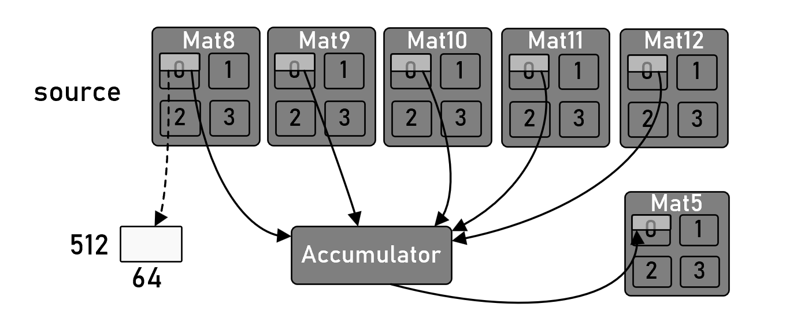

Start the simulation:
<ol>
<li>Compile C program</li>

Go back to `chipyard/toolchains/riscv-tools/riscv-tests/benchmarks`, make sure `ACC_test` is in Makefile:
```
bmarks = \
	ACC_test \
```

Then run `make`. Afterwards, `ACC_test.riscv` will generated under the folder.

<li>Compile hardware and run simulation</li>

Go to `chipyard/sims/verilator` (use vcs here), then run the following code:
```
make run-binary LOADMEM=1 CONFIG=PICRocket1024 BINARY=/root/chipyard/toolchains/riscv-tools/riscv-tests/benchmarks/ACC_test.riscv VERILATORTHREADS=10 -j 10
```

The first time running needs to compile the hardware first. 
Then the simulation will output the C test program printf like:
```
Switch successfully!
...
...
...
################ Runtime State ###############
Available Cache Volumn (KB) = 1024
Available PIC Volumn (KB) = 0
Available Mats = 0
Available Mats Range = 63~63
##############################################
ACC check start!
This Acc result is all correct!
```

</ol>

## 4. FPGA deployment (Run Linux)

The FPGA deployment implementation is based on https://github.com/eugene-tarassov/vivado-risc-v from eugene-tarassov.
The modified project is `FPGA_deploy`.
We further modify the process and make it support zcu102 and customized boards.
This step is elaborated based on zcu102, and directly use our modified script that supports the zcu102.
Since the Chipyard version at the time (2024) was incompatible with the FPGA deployment repository vivado-risc-v, we performed manual modifications. 
We also utilized a pre-compiled Ubuntu system image from vivado-risc-v repo to skip the manual compilation process. 
As the vivado-risc-v has been updated recently, our future work will try to synchronizing the project with the latest vivado-risc-v repo.
With respect to how to support customized boards not from Xilinx and create the script, the turtorial will also be provided in other section. 

### 4.1 Hardware Preparation (zcu102 as example)

<ol>
<li>SD card slot preparasion</li>

For easy implementation and follow the method in eugene-tarassov/vivado-risc-v, we choose to use an external memory card.

The implementation only use the PL, and PS will not be used, so the SD slot connnected to the PS will not work.

Therefore, an external storage card is needed.

<p align="center">
  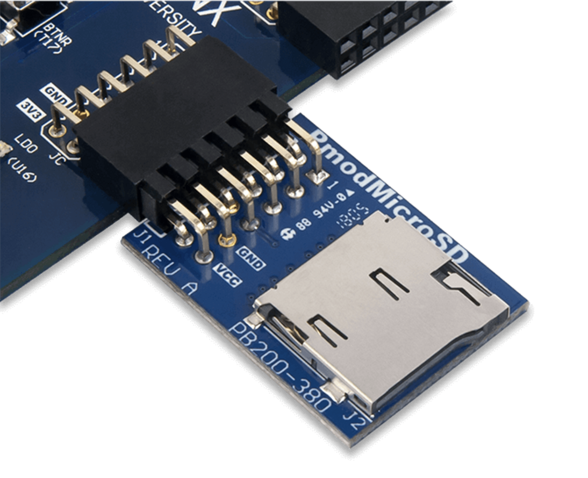
</p>

It uses PMOD connector, which is supported by PL side of zcu102. Connect it to the board like this:

<p align="center">
  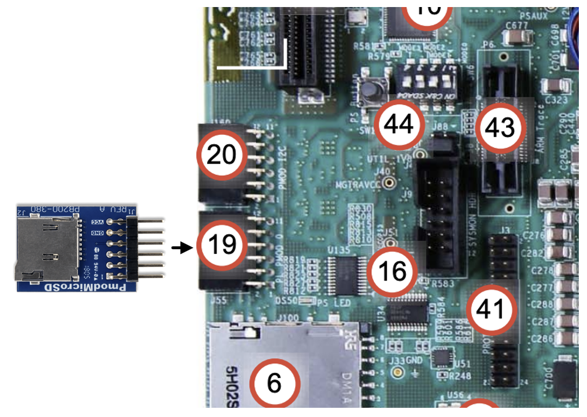
</p>


<li>Board Start mode</li>

<p align="center">
  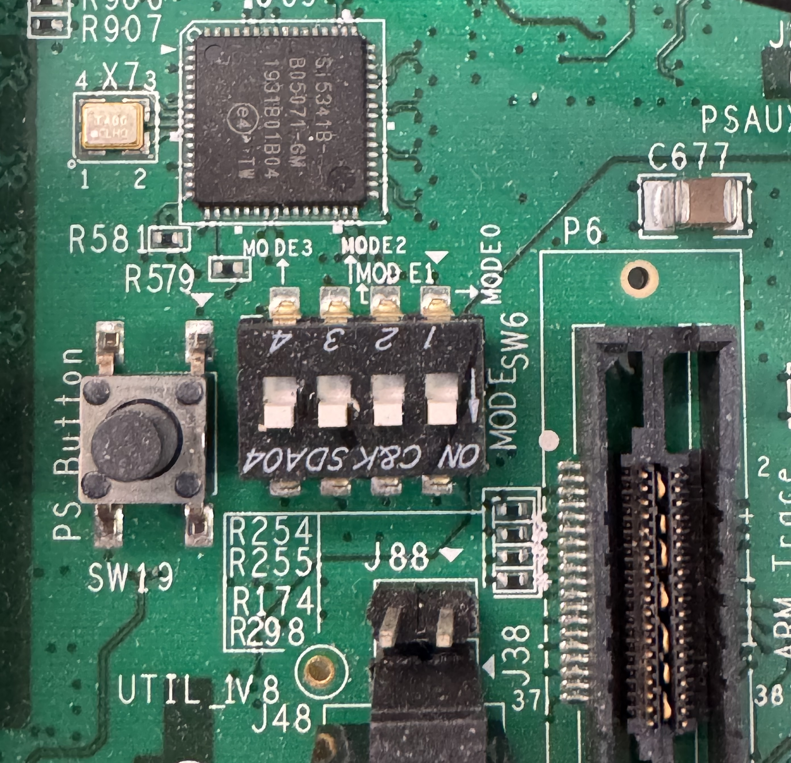
</p>

</ol>


### 4.2 FPGA deployment tools and scripts

This step uses `FPGA_deploy` folder.
We modify https://github.com/eugene-tarassov/vivado-risc-v and only keep the function of vivado tcl script generation and qemu emulation.

We will try to keep up with the latest version of vivado-risc-v and further match the flexibility of customized Linux image generation flow.
Currently, we use the compiled Linux image from vivado-risc-v repo.

⚠️ For easy use, you'd better make operation of `FPGA_deploy` in a container (docker).

<ol>

<li>Install necessary tools</li>

Go to <code>FPGA_deploy</code>, run:
```
make apt-install
```

<li>Compile the SoC rtl and gen vivado tcl</li>

For easy operation, we have added the PolymorPIC customized code to FPGA_deploy.
You can check `FPGA_deploy/generators/sifive-cache` and find that it is the same as the one under chipyard (For version reason, the name here is stil sifive-cache).
The rocket-chip and boom code are also modified (`FPGA_deploy/generators/riscv-boom` and `rocket-chip`), similar in Chipyard.
This means if you change design in Chipyard, you should also change it here for FPGA deployment.

📝 Further work will try to use a patch method to apply modification to these codes for easy and clear operation.

Now, check `FPGA_deploy/src/main/scala/rocket.scala`, you can find the SoC generation configuration here.
Most configuration is pre-written by `vivado-risc-v` repo, we dont use them.
We use our own configuration `BigRocketPIC1024KB` as example here


Under the folder `FPGA_deploy`, run command:
```bash
make vivado-tcl BOARD=zcu102 CONFIG=BigRocketPIC1024KB ROCKET_FREQ_MHZ=72.0
```
Then the compile begins. 
During the process, it will download a riscv tool from `vivado-risc-v` repo, about 500MB.
Download occurs only once. Cached file will be used for future runs.
Afterwards, a folder named `workspace` is generated. 
If you see the outputs like following, the process finishes successfully:
```
...
echo "set riscv_clock_frequency 72.0" >>workspace/BigRocketPIC1024KB/system-zcu102.tcl
echo "set memory_size 0x20000000" >>workspace/BigRocketPIC1024KB/system-zcu102.tcl
echo 'cd [file dirname [file normalize [info script]]]' >>workspace/BigRocketPIC1024KB/system-zcu102.tcl
echo 'source ../../vivado.tcl' >>workspace/BigRocketPIC1024KB/system-zcu102.tcl
```

It should be copied to a machine with Vivado2022.2. 
It contains necessary modules RTL files and vivado block design generation scripts.
For easy movement, we set a pack command.
Input the pack command:
```bash
make pack PACK_NAME=zcu102_bigrocket_PIC_1M_72mhz
```

Then the necessary files will be packed into `zcu102_bigrocket_PIC_1M_72mhz.tar` and moved to `/root/`.

Copy `zcu102_bigrocket_PIC_1M_72mhz.tar` to a machine having vivado2022.2.

Go to the mechine having vivado. Extract the files `zcu102_bigrocket_PIC_1M_72mhz.tar` and open vivado.

```bash
source <PATH_TO_zcu102_bigRocket_pic_1024_72mhz>/workspace/BigRocketPIC1024KB/system-zcu102.tcl
```

Open vivado, input the upper command to vivado tcl console:
<p align="center">
  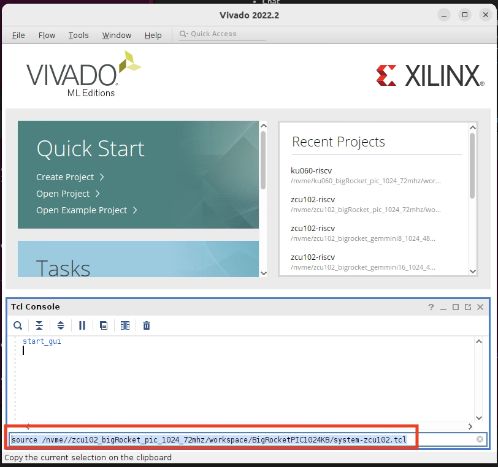
</p>


The `system-zcu102.tcl` is the script that can setup the whole vivado project.

Then, the vivado project is generated. The block design is like:
<p align="center">
  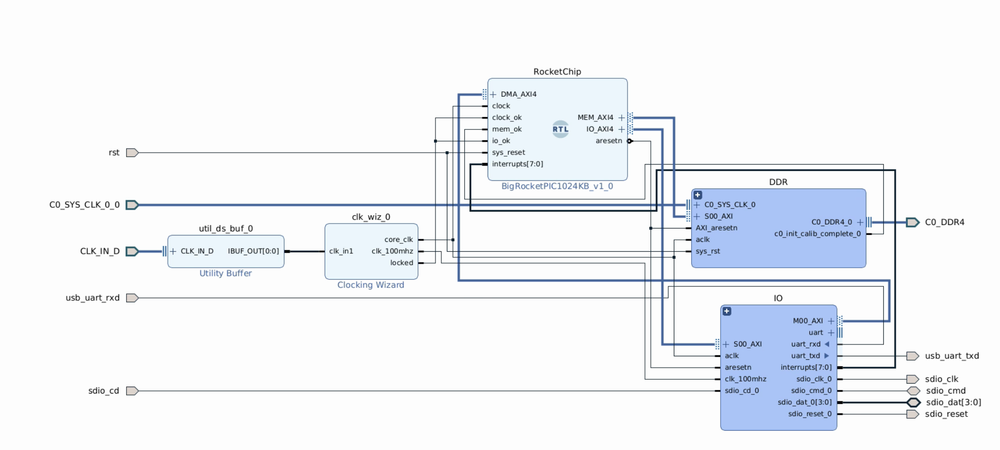
</p>

The `.xdc` file defines the some connection to the peripheral device like SD, UART and reset button.
For example, to reset, use the button in the figure:
<p align="center">
  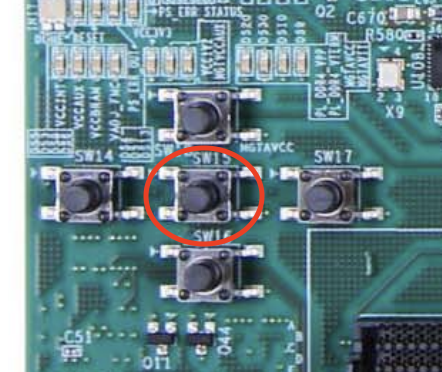
</p>

This constrain of the reset is defined in `top.xdc`:
```
set_property PACKAGE_PIN AG13 [get_ports rst]
set_property IOSTANDARD LVCMOS33 [get_ports rst]
```

Then, run Synthesis and Implementaion and Generate Bitstream.
The resource on zcu102 pl is:
<p align="center">
  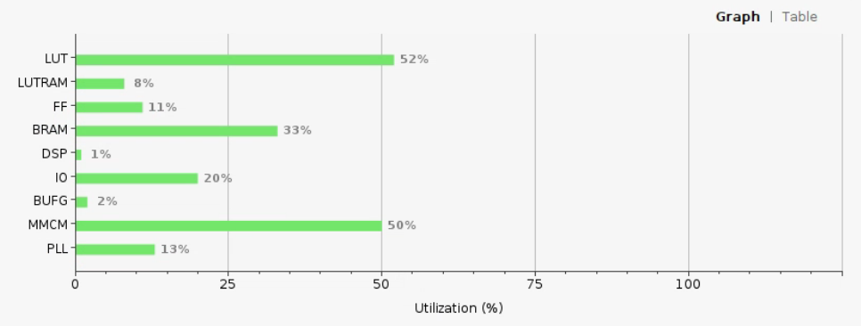
</p>


</ol>

### 4.3 Software Preparation

This step aims to prepare the linux image, which contains the programs to run on FPGA.
Take ACC_test as an example here.

<ol>
<li>Ubuntu Image</li>

In the original steps of `https://github.com/eugene-tarassov/vivado-risc-v`, the Linux image is compiled manually.

For easy deployment, we use the compiled ones `https://github.com/eugene-tarassov/vivado-risc-v/releases/download/v3.7.0/debian-riscv64.sd.img.gz`

We further shut down the network function at start up, which make the system start process much faster (3x faster).

Here is our image:
`!TO BE UPLOADED!`

Unpack it and get `debian-riscv64.sd.img`.

<li>Prepare test program: ACC test as an example</li>

Now, go back to the chipyard, we stil use the code under benchmarks.

The Accumulator has been test on RTL simulator like VCS and verilator under Chipyard, however, those simulation is based on baremetal.

To run simulation on Linux on system-level, the page needs to be locked. 

The code is like (`ACC_test/main.c`):
```C
#ifdef LINUX
    if (mlockall(MCL_CURRENT | MCL_FUTURE) != 0) 
    {
        perror("mlockall failed");
        exit(1);
    }
#endif

#ifdef PIC_MODE
    conduct_alloc(15);
#endif
    printf("Test a1 begin.\n");
```
</ol>

In the last step, the pre-build image is ready `debian-riscv64.sd.img`. 

Steps to cross-compile and move the execution file to the image:
<ol>
<li>Compile the riscv execution using cross-comepile</li>

The host machine should install:
```bash
apt install gcc-riscv64-linux-gnu g++-riscv64-linux-gnu
```
Then go to the `ACC_test` folder and run:
```bash
riscv64-linux-gnu-gcc  -DLINUX -o  ACC main.c ISA.c
```
Then we get elf file `ACC`.

<li>Copy file to the Linux image</li>

The image file should be mount to the host first, so that we can move file to it.
The file system is the second section of the provided `debian-riscv64.sd.img`.

You can use the provided scrip to mount (`Image_mount/mount.sh`):
```bash
./mount.sh debian-riscv64.sd.img 2 /root/img_mount/
```

It is mount to the folder `/root/img_mount/` (you can choose another place):
<p align="center">
  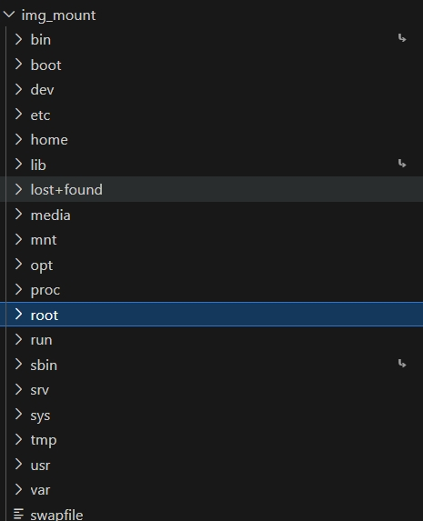
</p>

Directly copy the elf `ACC` to root or any other folders.

Then, umount (⚠️ Dont forget to unmont!! Dont forget to change address according to yours!!):
```bash
./umount.sh debian-riscv64.sd.img /root/img_mount/
```

Then, flash the `debian-riscv64.sd.img` to the SD card using balenaEtcher or any other tools. 

</ol>

### 4.4 Start FPGA

Complete the following steps:

✅ Connect zcu102 jtag and uart to the machine.

✅ Connect the SD card to the zcu102.

✅ Use vivado to program the device.

✅ Open serial monitor to watch the uart output (115200):

<p align="center">
  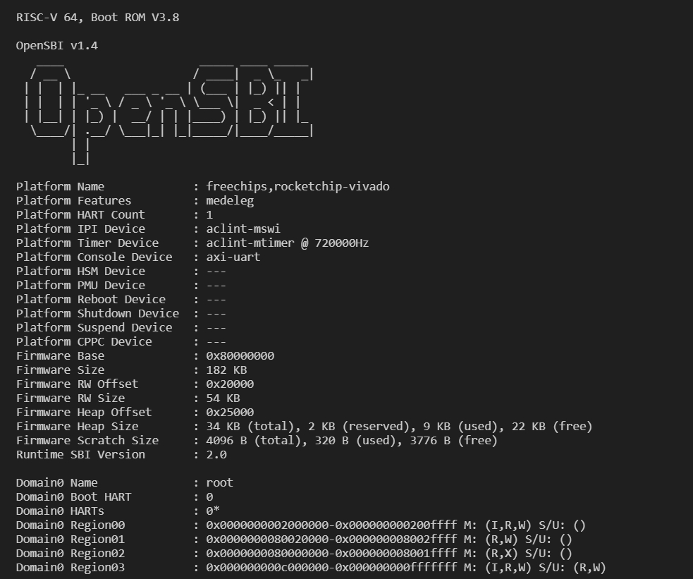
</p>

Then, there is login step:
```
debian login: root
Password: 
Linux debian 6.9.6-dirty #1 SMP Fri Jul 19 23:29:15 CST 2024 riscv64

The programs included with the Debian GNU/Linux system are free software;
the exact distribution terms for each program are described in the
individual files in /usr/share/doc/*/copyright.

Debian GNU/Linux comes with ABSOLUTELY NO WARRANTY, to the extent
permitted by applicable law.
root@debian:~#
```

The username is `root` and the password is `1`.

Run `ACC`:

</ol>


### 4.5 How to configure the Linux via Qemu (Optional)

If you want to install some tools to the Linux image, you can use qemu on your host mechine.

For example, if you want to install `mbw` tools, you can use Qemu to run `apt install`.

Go to the folder `FPGA_deploy`.

Then, install qemu:
```bash
make apt-install-qemu
```

Setup qemu, which needs specific bios compiled by u-boot and opensbi:
```
make u-boot-qemu
make opensbi-qemu
```
Then, under `FPGA_deploy`, run:
```bash
./qemu/boot_qemu.sh <IMAGE_PATH>
```

Login with `root` and password 1:
```
debian login: root
Password: 
Linux debian 6.9.6-dirty #1 SMP Fri Jul 19 23:29:15 CST 2024 riscv64

The programs included with the Debian GNU/Linux system are free software;
the exact distribution terms for each program are described in the
individual files in /usr/share/doc/*/copyright.

Debian GNU/Linux comes with ABSOLUTELY NO WARRANTY, to the extent
permitted by applicable law.
root@debian:~#
```

Because in our provided image, network is disabled, if you want to download things, it should be enabled.
Start it temporarily, run (still won't run when sys startup):
```bash
systemctl start networking.service
```

Then, do whatere you want.

If you want to exit, use poweroff:
```
root@debian:~# poweroff
```

Then press ctrl+A. 
Release ctrl+A then press X to exit qemu.


## 5. Q&A

<ol>
<li>String problem during chipyard running or FPGA flow</li>

Try to execute the following commands:

```
apt-get install -y locales
localedef -i en_US -c -f UTF-8 -A /usr/share/locale/locale.alias en_US.UTF-8
locale-gen en_US.UTF-8
```

<li>Vivado has no device part.</li>

When source tcl script in vivado TCL console, it gives error:
```bash
WARNING: [Device 21-436] No parts matched 'xczu9eg-ffvb1156-2-e'
ERROR: [Coretcl 2-106] Specified part could not be found.

    while executing
"source ../../vivado.tcl"
    (file "G:/Downloads/zcu102_bigrocket_PIC_1M_72mhz/workspace/BigRocketPIC1024KB/system-zcu102.tcl" line 8)
```

This happens because you have no device part (zcu102) installed in vivado.

If zcu102 is used, there is no board files because you install vivado standard.
You should change it to enterprise version.

</ol>